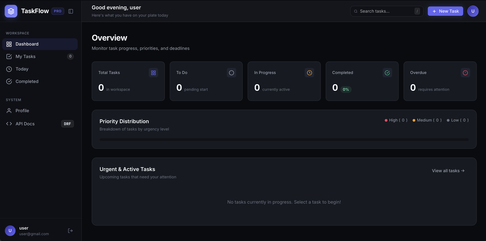
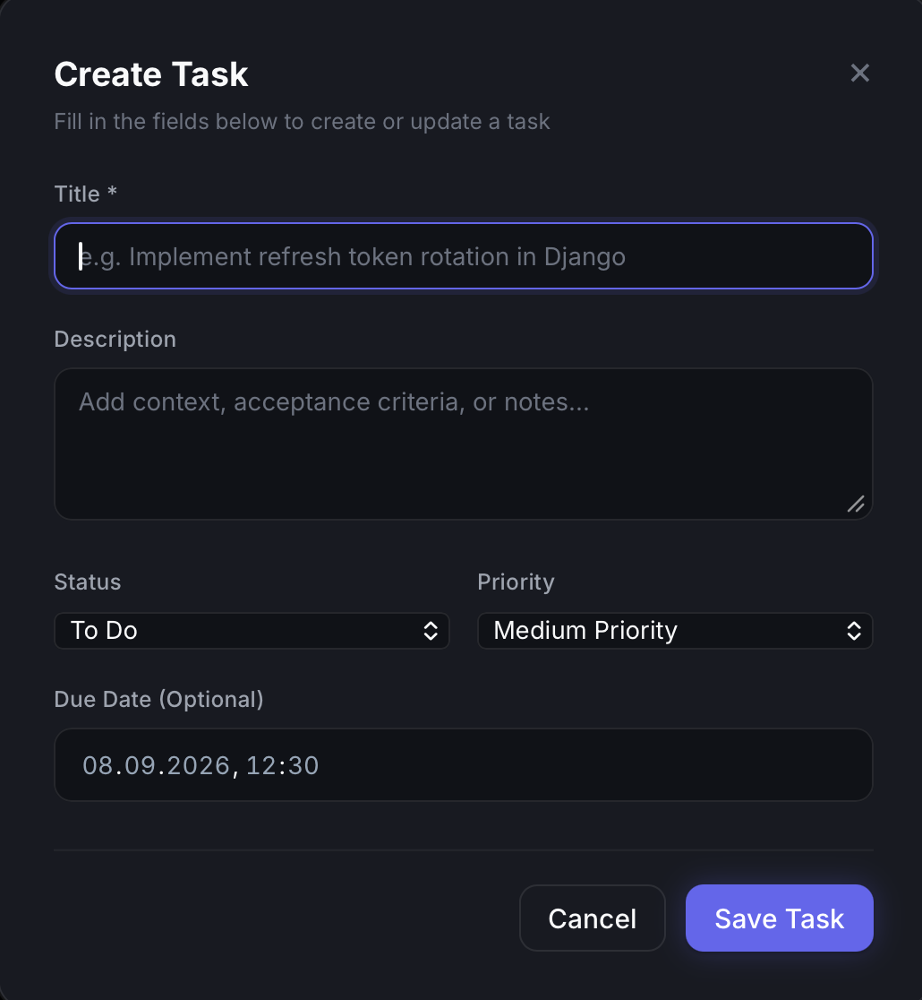
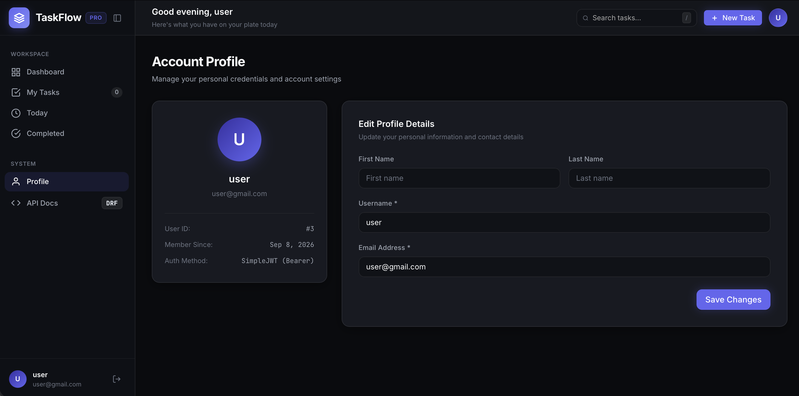
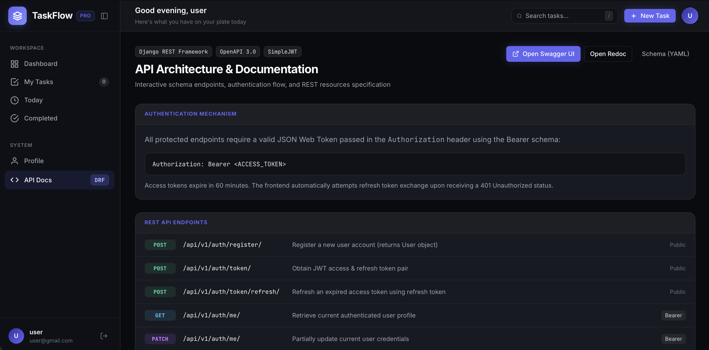
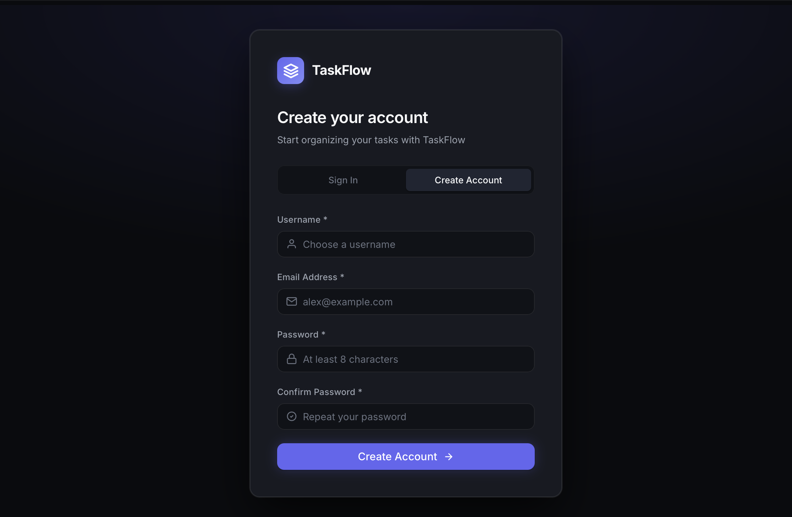

# ⚡ TaskFlow — Task Management API & Service

[](https://github.com/hezhenn/taskmanager/actions/workflows/ci.yml)

A production-ready RESTful API and task management service built with **Django REST Framework**, **PostgreSQL**, **Redis**, **Celery**, and **Docker**. Features JWT authentication, API rate limiting, ownership-based access control, Redis Cache-Aside task analytics with smart signal invalidation, asynchronous background worker alerts, automated periodic digests via Celery Beat, and comprehensive OpenAPI 3.0 documentation. Includes an interactive single-page web interface for managing and testing tasks.

---

## 🛠️ Tech Stack

### Backend & Async
<p>
  
  
  
  
  
  
  
</p>

### Frontend
<p>
  
  
  
</p>

### Database & Docs
<p>
  
  
  
</p>

### Infrastructure & Testing
<p>
  
  
  
  
</p>

---

## 🖥️ Interface Preview

| Workspace Dashboard | Task Creation Modal |
| :---: | :---: |
|  |  |
| *Real-time metrics, task status counters, and priority breakdown* | *Task creation dialog with priority tags and deadline pickers* |

| Account Profile | Interactive API Architecture & Docs |
| :---: | :---: |
|  |  |
| *User settings and live profile updates via PATCH /api/v1/auth/me/* | *In-app developer hub with endpoint specs and schema links* |

<div align="center">
  
  <p><em>Authentication & Registration — Secure JWT-based auth flow with token management</em></p>
</div>

---

## ✨ Overview

**TaskFlow** is a task management backend service and interactive application built to demonstrate production-style Django development: clean modular structure, token-based authentication, permission-based data access, asynchronous worker pipelines, automated testing, and multi-service container orchestration.

The project was built as a portfolio piece to demonstrate:

- REST API design with Django REST Framework (serializers, viewsets, filters)
- JWT authentication with automatic client-side token refresh
- API rate limiting and security throttling against brute-force attacks
- Ownership-based access control (users can only access and modify their own data)
- High-performance caching with Redis (Cache-Aside pattern and signal-based cache invalidation)
- Asynchronous task processing and scheduled routines with Celery and Redis
- Single-page application interface for direct API interaction
- Automated testing and CI/CD with `pytest` (36 tests), `flake8`, and GitHub Actions
- OpenAPI 3.0 documentation with Swagger UI and Redoc
- Multi-service orchestration with Docker Compose (5 services)

---

## 📑 Table of Contents

- [Interface Preview](#interface-preview)
- [Features](#features)
- [Architecture](#architecture)
- [Project Structure](#project-structure)
- [Requirements](#requirements)
- [Environment Variables](#environment-variables)
- [Running the Project](#running-the-project)
- [Local Setup (Without Docker)](#local-setup-without-docker)
- [Testing & Code Quality](#testing--code-quality)
- [API Endpoints](#api-endpoints)
- [Example API Usage](#example-api-usage)
- [Asynchronous & Periodic Tasks](#asynchronous--periodic-tasks-celery--redis)
- [Performance & Redis Caching](#performance--redis-caching)
- [Security & Rate Limiting](#security--rate-limiting)
- [Possible Improvements](#possible-improvements)
- [What I Practiced](#what-i-practiced)
- [Author](#author)

---

## 🚀 Features

- **Authentication & Security**
  - JWT authentication (`access` & `refresh` tokens)
  - User registration with password validation
  - API rate limiting & brute-force protection (10 req/min login, 5 req/min registration)
  - Authenticated profile retrieval and update
- **Task Management & Performance**
  - Full CRUD operations on tasks
  - Ownership-based permissions — users only access their own tasks
  - Task statuses: `TODO`, `IN_PROGRESS`, `DONE`
  - Task priorities: `LOW`, `MEDIUM`, `HIGH`
  - Optional due dates
  - Task analytics and statistics (`/api/v1/tasks/statistics/`)
  - **Redis Cache-Aside optimization** with smart signal-based cache invalidation
- **Asynchronous & Periodic Tasks (Celery + Redis)**
  - Immediate asynchronous email alerts dispatched upon high-priority task creation
  - Daily overdue task digest automated via Celery Beat periodic scheduler
  - Containerized Celery worker and scheduler with health checks
- **Filtering, Search & Pagination**
  - Filter by status, priority, and due date range
  - Full-text search across title and description
  - Ordering by due date, priority, creation date, or title
  - Page-number pagination
- **Documentation**
  - OpenAPI 3.0 schema
  - Swagger UI and Redoc
- **Testing**
  - 36 automated tests covering auth, permissions, CRUD, analytics, Celery tasks, caching, and rate limiting
- **Containerization**
  - Fully Dockerized with PostgreSQL, Redis, Celery Worker, and Celery Beat

---

## 🏗️ Architecture

The application is architected around a multi-service containerized environment orchestrated via Docker Compose:

### `web`
The Django application:
- handles authentication and JWT issuing
- exposes the Tasks REST API (CRUD, filtering, search, pagination, statistics)
- serves the interactive web application interface and static assets
- enforces ownership-based permissions
- generates OpenAPI schema and serves Swagger/Redoc

### `db`
PostgreSQL database:
- stores users, tasks, and related metadata
- runs with a Docker health check to ensure dependent services start only once the database is healthy

### `redis`
Redis in-memory data store:
- serves as the message broker and result backend for Celery (DB 0)
- serves as the high-performance distributed cache backend for analytics (DB 1)

### `celery_worker`
Celery background worker:
- processes asynchronous jobs off the main request-response cycle (e.g. email dispatches)

### `celery_beat`
Celery Beat scheduler:
- periodically triggers recurring routines (daily overdue tasks digest)

---

## 📁 Project Structure

```text
taskmanager/
├── apps/
│   ├── accounts/
│   │   ├── migrations/
│   │   ├── admin.py
│   │   ├── apps.py
│   │   ├── models.py
│   │   ├── serializers.py
│   │   ├── tests.py
│   │   ├── throttles.py
│   │   ├── urls.py
│   │   └── views.py
│   └── tasks/
│       ├── migrations/
│       ├── admin.py
│       ├── apps.py
│       ├── filters.py
│       ├── models.py
│       ├── permissions.py
│       ├── serializers.py
│       ├── signals.py
│       ├── tasks.py
│       ├── tests.py
│       ├── urls.py
│       └── views.py
├── config/
│   ├── asgi.py
│   ├── celery.py
│   ├── settings.py
│   ├── urls.py
│   └── wsgi.py
├── docs/
│   └── images/
├── static/
│   ├── css/
│   │   └── style.css
│   └── js/
│       └── app.js
├── templates/
│   └── index.html
├── .flake8
├── .github/
│   └── workflows/
│       └── ci.yml
├── .dockerignore
├── .env.example
├── .gitignore
├── conftest.py
├── docker-compose.yml
├── Dockerfile
├── manage.py
├── pytest.ini
├── requirements.txt
└── README.md
```

---

## 📦 Requirements

- **Docker & Docker Compose** (recommended for containerized execution)
- **Python 3.12+** (for local development without Docker)
- **PostgreSQL 16** & **Redis 7** (or SQLite fallback for quick local testing)

---

## 🔐 Environment Variables

Create a `.env` file in the project root. Use `.env.example` as a template.

```env
# Django
SECRET_KEY=your-secret-key
DEBUG=True

# Database
POSTGRES_DB=taskmanager
POSTGRES_USER=postgres
POSTGRES_PASSWORD=your_password
POSTGRES_HOST=db
POSTGRES_PORT=5432

# Celery & Redis
CELERY_BROKER_URL=redis://localhost:6379/0
CELERY_RESULT_BACKEND=redis://localhost:6379/0
REDIS_CACHE_URL=redis://localhost:6379/1
TASK_STATISTICS_CACHE_TTL=600

# Rate Limiting (Throttling)
THROTTLE_RATE_ANON=100/minute
THROTTLE_RATE_USER=1000/minute
THROTTLE_RATE_AUTH=10/minute
THROTTLE_RATE_REGISTER=5/minute
```

If PostgreSQL and Redis environment variables are not set, the project falls back to SQLite, local in-memory caching (`LocMemCache`), and synchronous task execution for local development.

---

## 🚀 Running the Project

### 1. Clone the repository

```bash
git clone https://github.com/hezhenn/taskmanager.git
cd taskmanager
```

### 2. Configure environment variables

```bash
cp .env.example .env
```

### 3. Start the containers

```bash
docker compose up --build
```

Docker Compose orchestrates 5 interconnected services:
- **`db`**: PostgreSQL 16 database with health check
- **`redis`**: Redis 7 in-memory broker with health check
- **`web`**: Django API & web interface service running migrations on boot
- **`celery_worker`**: Background worker for asynchronous email dispatches
- **`celery_beat`**: Scheduler for periodic daily task digests

### 4. Access the Application & Documentation

- **Web Application Interface**: `http://localhost:8000/`
- **Interactive Swagger UI**: `http://localhost:8000/api/docs/`
- **Redoc Documentation**: `http://localhost:8000/api/redoc/`
- **OpenAPI Schema (YAML)**: `http://localhost:8000/api/schema/`

---

## 💻 Local Setup (Without Docker)

```bash
python3 -m venv .venv
source .venv/bin/activate  # On Windows: .venv\Scripts\activate

pip install -r requirements.txt

cp .env.example .env

python manage.py migrate
python manage.py runserver

# Optional: run Celery background worker (requires local Redis instance)
celery -A config worker -l info
```

---

## 🧪 Testing & Code Quality

### Automated Tests

```bash
pytest
```

The test suite contains **36 automated tests** covering:
- User registration, authentication, token refresh, and profile management
- API rate limiting (throttling) and brute-force protection (`HTTP 429`)
- Task CRUD lifecycle and ownership-based access control
- Query filtering, full-text search, ordering, and pagination
- Dashboard statistics calculation and edge cases (e.g. users with 0 tasks)
- Redis Cache-Aside pattern (cache hit/miss) and signal-based cache invalidation
- Asynchronous Celery alerts and Celery Beat periodic digest dispatch

All tests pass with 100% success rate against PostgreSQL in CI.

### Code Quality & Standards

```bash
# Run Flake8 linter (PEP 8 compliance)
flake8

# Django system configuration check
python manage.py check

# Validate OpenAPI 3.0 schema generation
python manage.py spectacular --validate --fail-on-warn
```

---

## 🌍 API Endpoints

### Authentication (`/api/v1/auth/`)

| Method | Endpoint | Description | Rate Limit | Auth Required |
|--------|----------|--------------|------------|----------------|
| POST | `/register/` | Register a new user | 5 req/min | No |
| POST | `/token/` | Obtain JWT access and refresh tokens | 10 req/min | No |
| POST | `/token/refresh/` | Refresh expired access token | 10 req/min | No |
| GET | `/me/` | Retrieve current user profile | 1000 req/min | Yes |
| PATCH | `/me/` | Update current user profile | 1000 req/min | Yes |

### Tasks (`/api/v1/tasks/`)

| Method | Endpoint | Description | Auth Required |
|--------|----------|--------------|----------------|
| GET | `/` | List user's tasks (paginated) | Yes |
| POST | `/` | Create a new task | Yes |
| GET | `/statistics/` | Task analytics & metrics (cached via Redis) | Yes |
| GET | `/{id}/` | Retrieve task details (owner only) | Yes |
| PUT | `/{id}/` | Full update of task (owner only) | Yes |
| PATCH | `/{id}/` | Partial update of task (owner only) | Yes |
| DELETE | `/{id}/` | Delete task (owner only) | Yes |

#### Supported Query Parameters (`GET /api/v1/tasks/`)

| Parameter | Type | Description | Example |
|-----------|------|-------------|---------|
| `status` | string | Filter by status (`TODO`, `IN_PROGRESS`, `DONE`) | `?status=IN_PROGRESS` |
| `priority` | string | Filter by priority (`LOW`, `MEDIUM`, `HIGH`) | `?priority=HIGH` |
| `due_date_after` | date | Filter tasks due on or after date | `?due_date_after=2026-09-01` |
| `due_date_before` | date | Filter tasks due on or before date | `?due_date_before=2026-09-30` |
| `search` | string | Full-text search across title and description | `?search=Docker` |
| `ordering` | string | Sort by field (`due_date`, `priority`, `created_at`, `title`) | `?ordering=-created_at` |
| `page` | integer | Page number for pagination | `?page=2` |

### Documentation

| Endpoint | Description |
|----------|--------------|
| `/api/schema/` | Download OpenAPI 3.0 schema (YAML/JSON) |
| `/api/docs/` | Interactive Swagger UI |
| `/api/redoc/` | Interactive Redoc documentation |

---

## 💡 Example API Usage

### 1. Register a user

```bash
curl -X POST http://localhost:8000/api/v1/auth/register/ \
  -H "Content-Type: application/json" \
  -d '{
    "username": "alex",
    "email": "alex@example.com",
    "password": "SecurePassword123!",
    "password_confirm": "SecurePassword123!"
  }'
```

### 2. Obtain a JWT token

```bash
curl -X POST http://localhost:8000/api/v1/auth/token/ \
  -H "Content-Type: application/json" \
  -d '{
    "username": "alex",
    "password": "SecurePassword123!"
  }'
```

Response:

```json
{
  "access": "<YOUR_ACCESS_TOKEN>",
  "refresh": "<YOUR_REFRESH_TOKEN>"
}
```

### 3. Refresh an access token

```bash
curl -X POST http://localhost:8000/api/v1/auth/token/refresh/ \
  -H "Content-Type: application/json" \
  -d '{
    "refresh": "<YOUR_REFRESH_TOKEN>"
  }'
```

### 4. Create a task

```bash
curl -X POST http://localhost:8000/api/v1/tasks/ \
  -H "Content-Type: application/json" \
  -H "Authorization: Bearer <YOUR_ACCESS_TOKEN>" \
  -d '{
    "title": "Complete Django project",
    "description": "Implement authentication and tasks CRUD",
    "priority": "HIGH",
    "status": "IN_PROGRESS"
  }'
```

### 5. Filter and search tasks

```bash
curl -G http://localhost:8000/api/v1/tasks/ \
  -H "Authorization: Bearer <YOUR_ACCESS_TOKEN>" \
  -d "status=IN_PROGRESS" \
  -d "search=Django"
```

### 6. Retrieve current user profile

```bash
curl -X GET http://localhost:8000/api/v1/auth/me/ \
  -H "Authorization: Bearer <YOUR_ACCESS_TOKEN>"
```

### 7. Retrieve dashboard analytics & statistics (Cached via Redis)

```bash
curl -X GET http://localhost:8000/api/v1/tasks/statistics/ \
  -H "Authorization: Bearer <YOUR_ACCESS_TOKEN>"
```

*(Accelerated by the Redis Cache-Aside pattern; automatically invalidated upon task create/update/delete)*

Response:

```json
{
  "total": 10,
  "by_status": {
    "todo": 3,
    "in_progress": 4,
    "done": 3
  },
  "by_priority": {
    "high": 2,
    "medium": 5,
    "low": 3
  },
  "overdue": 1,
  "completion_rate_percentage": 30.0
}
```

---

## ⚡ Asynchronous & Periodic Tasks (Celery + Redis)

TaskFlow offloads non-blocking operations and scheduled workflows to Celery workers using Redis as the message broker:

1. **High-Priority Task Alerts (`send_task_high_priority_alert`)**
   - Dispatched asynchronously upon creation of tasks with `HIGH` priority.
   - Sends an email notification to the task owner containing task metadata and deadline.

2. **Daily Overdue Tasks Digest (`send_overdue_tasks_digest`)**
   - Scheduled via **Celery Beat** to execute periodically.
   - Queries all uncompleted tasks where `due_date < now()`.
   - Aggregates overdue tasks per user and sends a summary digest email.

---

## ⚡ Performance & Redis Caching

To reduce database load and eliminate redundant heavy aggregation queries, TaskFlow implements the **Cache-Aside pattern** with Redis:

- **Cached Endpoint**: `GET /api/v1/tasks/statistics/`
- **Cache Key Design**: `taskflow:user:{user_id}:statistics` (isolated per authenticated user)
- **TTL (Time-To-Live)**: Configurable (defaults to 10 minutes / 600s via `TASK_STATISTICS_CACHE_TTL`)
- **Signal-Driven Cache Invalidation**: Automatic cache invalidation is connected via Django signals (`post_save` and `post_delete` on the `Task` model). Any time a user creates, updates, or deletes a task, their cached statistics key is instantly evicted, guaranteeing zero stale data on subsequent reads.

---

## 🛡️ Security & Rate Limiting

TaskFlow protects sensitive API endpoints from brute-force password guessing, credential stuffing, and automated spam registration using DRF's throttling architecture:

- **Obtain Token (`/api/v1/auth/token/`)**: Throttled to **10 requests / minute** per IP address.
- **User Registration (`/api/v1/auth/register/`)**: Throttled to **5 requests / minute** per IP address.
- **General Anonymous Rate**: 100 requests / minute.
- **General Authenticated User Rate**: 1000 requests / minute.
- **Dynamic Scoped Throttling**: Implemented via custom `DynamicScopedRateThrottle` allowing dynamic configuration via environment variables and flexible test isolation.
- **Reverse Proxy & Docker IP Resolution**: Accurately resolves individual client IPs behind Docker bridges, Nginx, and Cloudflare by prioritizing `X-Real-IP` and parsing the client address from `X-Forwarded-For`, preventing shared-proxy IP rate limit collisions.
- **HTTP 429 Response**: When requests exceed threshold limits, the API responds with `HTTP 429 Too Many Requests` including standard `Retry-After` headers.

---

## 🔮 Possible Improvements

A few ideas for future development:

- Add WebSocket / Server-Sent Events for real-time task board updates
- Add soft-delete (`is_deleted`, `deleted_at`) with trash bin and task restoration (`/restore/`)
- Add task activity history log and comment threads
- Add CSV export of user tasks dispatched as an asynchronous background task

---

## 📚 What I Practiced

Through this project, I practiced and improved my skills in:

- designing a REST API with Django REST Framework (serializers, viewsets, routers)
- implementing JWT-based authentication and token refresh flows
- writing custom permission classes for ownership-based access control
- building filtering, search, and pagination for API resources
- generating and maintaining OpenAPI documentation with drf-spectacular
- integrating Celery and Redis for asynchronous task execution (email alerts) and periodic background jobs (Celery Beat digests)
- designing a high-performance caching layer with Redis (Cache-Aside pattern, TTL, signal-based invalidation)
- implementing API security policies and rate limiting (throttling against brute-force attacks)
- writing automated tests with pytest and pytest-django (36 unit & integration tests)
- configuring automated CI/CD workflows with GitHub Actions (Flake8 linting, PostgreSQL service, Redis service, test suite)
- orchestrating a multi-service containerized architecture (Django, PostgreSQL, Redis, Celery Worker, Celery Beat) with Docker Compose

This project was built as a practical portfolio piece to combine API design, authentication, testing, and Docker-based deployment in one application.

---

## 📄 License

This project is licensed under the MIT License.

---

## 👨‍💻 Author

**Stanislav Novhorodskyi** — Python Developer

[LinkedIn](https://www.linkedin.com/in/stanislav-novhorodskiy-482924388/) · [GitHub](https://github.com/hezhenn)